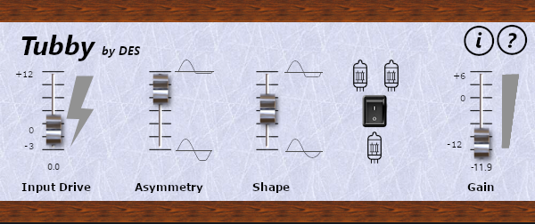

# Disthorzion

Basic Tube distortion simulator developed using [iPlug2](https://github.com/iPlug2/iPlug2) currently in Alpha stage.
Based on DAFX Second Edition Udo Zölzer section 4.3.1.  
I'm a newby at DSP, this project is meant just for learning.  
Based on iPlug2's IPlugEffect example.  
Only tested as VST3 within Reaper on Windows, I have no money for a Mac neither money for an Apple developer license.  

# Try it !

To build this project follow the setup instructions for iPlug2, then download this code and use it under iPlug2/Examples or any other folder at the same level.
I use a folder iPlug2/Projects.

Open `Disthorzion.sln`, this will open the project in Visual Studio (tested on Version 17.5.3)

To use it as an standalone app set Disthorzion-app as Startup project in Solution Explorer then run it.  
To try it as a VST3 plugin you can build Disthorzion-vst3 then use the plugin in your favourite DAW, or if you have [Reaper](https://www.reaper.fm/index.php) installed, then set Disthorzion-vst3 as Startup project in Solution Explorer then run it directrly from Visual Studio.  

# Files

Almost all the files in this project are cloned from iPlug2/Examples as described in 
[Duplicating Projects](https://github.com/iPlug2/iPlug2/wiki/Duplicating-Projects).  
This project own files are `Disthorzion.*` and `DCBlocker.*` .  
Some resources are located in the folders described below.

## gui-design folder

gui-design.xcf [GIMP](https://www.gimp.org/) project for the background image design.

## resources/img folder

bitmap resources for the controls

# TODO GUI

- Fix different sizes of Gain/Drive value editors, should be set with a common constant maybe in config.h 
- Improve GUI
- Highlight 1 or 2 valves selection
- Show DC Block Frequency control for fine tuning
- Remove SnapToMouse, it is fixed in ISliderControlBase::OnMouseDown (Override component)
- Add Help / About

# TODO DSP
- Antialiasing !!!
